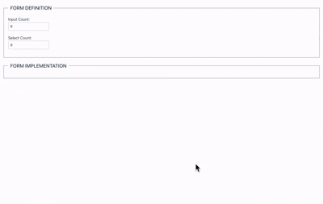

# Vue Dynamic Form
Vue Dynamic Form is a Vue 3 application that demonstrates dynamic form generation based on user-defined configurations. The application allows users to specify how many input fields and select dropdowns they want, and then dynamically creates a form with the specified number of fields.  

# Related Blog
https://dev.to/anirbmuk/vue-build-dynamic-reactive-form-141g. 

## Quick Start
Local development server  
```
http://localhost:5173  
```

## Installation
```bash
# Clone the repository
git clone https://github.com/anirbmuk/vue-dynamic-form.git
cd vue-dynamic-form

# Install dependencies
pnpm install

# Start development server
pnpm dev
```

## Key Features

### ✅ Implemented Features
- Dynamic form field generation
- Real-time configuration updates
- Memory-efficient state management
- Type-safe implementation with TypeScript
- Debug display of field values
- Responsive UI with proper form semantics

### 🔄 Reactive Behavior
- Form fields appear/disappear instantly
- Field values persist during configuration changes
- No unnecessary re-renders or state loss
- Efficient cleanup of unused resources

## Preview


## Potential improvements could include:

- [ ] Support for additional field types (textarea, checkbox, radio)
- [ ] Field validation system
- [ ] Form submission handling
- [ ] Field customization (labels, placeholders, options)
- [ ] Form templates/presets
- [ ] Export/import form configurations
- [ ] Advanced styling and theming
- [ ] Accessibility improvements